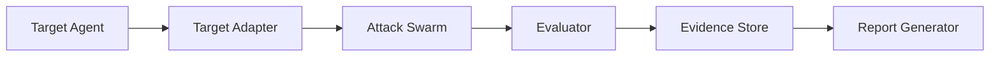

This is the architecture of AgentGuardian — the open-source
red-teaming toolkit. It runs **fully local**: there is no control
plane, no hosted gateway, no cloud egress unless you point an LLM
flag at a hosted model provider. Everything lives in the Python
package and your filesystem.

If you are looking for the runtime governance plane, managed evidence
store, or audit dashboards — that is AgentGuardian Enterprise from
Glacien. See [Open vs Enterprise](/concepts/open-vs-enterprise). The
remainder of this page is the OSS layer only.

## The six-box flow

Every scan walks left-to-right. No box reaches back. The arrows are
the only data paths.

### 1. Target Agent

Whatever you point AgentGuardian at: a system prompt file, a Python
callable, a hosted HTTP endpoint, a framework-native object (LangGraph,
CrewAI, AutoGen, OpenAI Agents, ADK, Strands), or an MCP server.

### 2. Target Adapter

A `TargetAdapter` (see `src/agent_guardian/adapters/base.py`)
normalises the target to a uniform `async def call(prompt, *, session)
-> str` interface and exposes a static `TargetFingerprint` describing
the attack surface — tools, memory, multi-agent hand-offs, PII
exposure, reachable external systems. Five adapter families ship in
the box; see [Target adapters](/concepts/target-adapters) for the
contract.

### 3. Attack Swarm

The sixteen specialist agents (ten OWASP ASI categories, one always-on
identity-leak gap-fill agent, and five OWASP-LLM specialists). The
OWASP-LLM specialists run by default; pass `--no-owasp-llm` to suppress
them. They run
under one `asyncio.TaskGroup` in Phase 3, each owning one category and
generating category-specific attack prompts. The applicability filter
(`AsiAgent.is_applicable(fingerprint)`) skips specialists whose
category cannot land on this target. See
[Adversarial swarm](/concepts/adversarial-swarm).

### 4. Evaluator

A separate LLM-as-judge labels each `(prompt, response)` pair against
a category-specific rubric and writes a `Finding` on
`verdict="fail"`. A heuristic pre-screen and the Rules-of-Engagement
controller surround the LLM judge as cheaper / stricter layers. See
[Evaluators](/concepts/evaluators).

### 5. Evidence Store

Findings, transcripts, AIVSS sub-scores, OWASP/MITRE/CSA mappings, and
the canonical `scan.json` are written under
`~/.agentguardian/scans/<scan_id>/`. The canonical file is signed
with HMAC-SHA256 and Ed25519 so any downstream consumer can verify it
with `agent-guardian verify`. This is the single source of truth for
the scan; everything else is derived from it.

### 6. Report Generator

Six emitters derive their output from the same canonical
`scan.json`:

| Format | Use it for | Source |
|---|---|---|
| `json` | Machine-readable, the canonical evidence file | `src/agent_guardian/reports/json_report.py` |
| `sarif` | GitHub Code Scanning / SOC tooling | `src/agent_guardian/reports/sarif.py` |
| `junit` | Any CI test dashboard | `src/agent_guardian/reports/junit.py` |
| `md` | Markdown for PR comments and READMEs | `src/agent_guardian/reports/markdown.py` |
| `gitlab` | GitLab SAST / Code Quality widget | `src/agent_guardian/reports/codeclimate.py` |
| `pdf` | Auditor and reviewer hand-offs | `src/agent_guardian/reports/pdf.py` |

The local **Live dashboard** at `http://127.0.0.1:7474/scan/<scan_id>`
reads the same `scan.json` plus a live reflection feed for in-flight
scans. See [Live dashboard](/architecture/live-dashboard).

## What this architecture is not

AgentGuardian is deliberately **not** a runtime gateway. It does
not sit in front of your production agent at request time. It does
not enforce policy on live traffic. It does not phone home. It does
not require a control plane.

It runs once, on demand, against a target you give it, on the
machine you run it on. That is the whole architecture.

For the runtime governance plane — managed evidence packs, team
workflows, policy enforcement, audit dashboards — see
[Open vs Enterprise](/concepts/open-vs-enterprise) and
[Enterprise](/enterprise/index).

## Subsystems worth knowing about

- **Rules of Engagement** (`src/agent_guardian/core/roe.py`) —
  declarative limits on what the scan may do (rate, max requests, tool
  allow/block lists, egress). Enforced at the single target-call
  chokepoint.
- **Budget controller** (`src/agent_guardian/core/budget.py`) —
  tokens, wall-clock, and USD caps. Soft-stops new attack turns at
  80% of any cap so the report phase always completes.
- **Coverage tracker** (`src/agent_guardian/core/coverage.py`) —
  records which probes from `src/agent_guardian/probes/asi01..asi10/`
  fired and writes coverage into the report.
- **Signing** (`src/agent_guardian/crypto/`) — HMAC-SHA256 +
  Ed25519. The signing anchor is created on first run and stored
  under `~/.agentguardian/keys/`. Loss of the anchor invalidates
  signatures, not the underlying findings.
- **Observability** (`src/agent_guardian/obs/`) — optional OTLP-HTTP
  export with GenAI semantic conventions for spans, metrics, and
  per-agent traces. Off by default. See
  [Observability](/architecture/observability).

## Where to go next

- [How AgentGuardian works](/concepts/how-agentguardian-works) — the
  developer mental model for the six boxes above.
- [Adversarial swarm](/concepts/adversarial-swarm) — the swarm internals.
- [Target adapters](/concepts/target-adapters) — the adapter contract.
- [Evaluators](/concepts/evaluators) — the verdict pipeline.
- [Live dashboard](/architecture/live-dashboard) — the local serve UI.
- [Observability](/architecture/observability) — OTLP export.
- [Open vs Enterprise](/concepts/open-vs-enterprise) — where this
  architecture ends and where the commercial governance plane begins.
