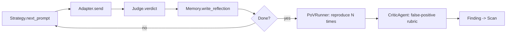

## What's in the library

AgentGuardian ships **124 probes** across the 10 OWASP-ASI 2026 categories.
Each probe is a YAML attack technique annotated with MITRE ATLAS v5.4.0
technique IDs and CSA Agentic-RT categories. The corpus is loaded at scan
start by `agent_guardian.probes.loader.load_all_probes` and dispatched by
the swarm's 14 parallel specialist agents.

<Info>
  Corpus version: **`2026.05`** (sourced from
  `src/agent_guardian/probes/_meta/version.yaml`). Run
  `agent-guardian list-probes` to enumerate every probe in your installed
  build.
</Info>

## When to extend it

Add a probe when you find a new attack class in production, when a CVE-style
disclosure surfaces a primitive your agent stack is exposed to, or when a
framework upgrade (LangGraph, OpenAI Agents SDK, A2A protocol) opens a new
seam. The probe schema lives at `src/agent_guardian/models/probe.py`.

## The 10 ASI categories

| ASI | Category | Probes | Default tier | Description |
| --- | --- | --- | --- | --- |
| ASI01 | Goal Hijack | 9 | T1 (1 × T4) | Adversary input overrides the agent's system goal — direct, indirect, or via tool output. |
| ASI02 | Tool Misuse | 8 | T1 | Argument injection, chain exfiltration, scope expansion, recursion bombs. |
| ASI03 | Privilege Abuse | 9 | T2 | Cross-tenant reads, JIT credential bypass, role inheritance, scope-token replay. |
| ASI04 | Supply Chain | 8 | T2 | MCP server poisoning, registry spoofing, plugin hijack, poisoned fine-tune checkpoints. |
| ASI05 | Code Execution | 8 | T1 | Sandbox escape, unsafe pickle, shell meta-injection, lockfile poisoning. |
| ASI06 | Memory Poisoning | 13 | T1 (5 HITL × T1/T2) | RAG corpus inject, persistent triggers, cross-tenant vector bleed, HITL bypasses. |
| ASI07 | Agent-to-Agent (A2A) | 8 | T2 | Supervisor impersonation, message-bus spoofing, confused deputy, protocol downgrade. |
| ASI08 | Cascading Failures | 8 | T3 | Retry storms, alarm suppression, dependency cascade, feedback-loop amplification. |
| ASI09 | Trust Exploitation | 17 | T1–T4 (mixed) | Output reflection XSS, fabricated citations, denial-of-wallet, classic jailbreaks. |
| ASI10 | Rogue Agents (drift) | 8 | T3 | Long-horizon drift, mode shift, capability mask, self-replicate via API. |

**Total: 96 probes.**

## How the attack engine exercises each probe

Every probe runs through the same per-turn loop. The Strategy proposes the
next adversarial prompt; the Adapter delivers it to your target; the Judge
verdicts the response; reflections write back to Memory. When the strategy
declares the technique exercised, the PoVRunner reproduces the finding `N`
times and the CriticAgent applies the false-positive rubric before the
finding lands on the scan.



## Attack families

The 10 ASI categories cluster into seven attacker-intent families. Use the
family that matches the surface you're hardening — a single probe often
maps to more than one family (memory-borne prompt injection lives in both
**Memory-level** and **Prompt-level** families).

### Prompt-level attacks

Adversary text — typed, fetched from a document, or relayed through a tool
— overrides the system goal.

<CardGroup cols={1}>
  <Card title="Prompt injection (ASI01)" icon="message-square-warning" href="/attacks/prompt-injection">
    20 probes. Direct goal redirect, indirect-via-doc, role-swap pretext,
    EchoLeak zero-click, persona-break jailbreak. Covers `--indirect` and
    `--pretext` flag paths.
  </Card>
</CardGroup>

### Tool-level attacks

Your agent's tools — exec, search, send-email, query-db — weaponised
through argument shape, chain composition, or supply-chain substitution.

<CardGroup cols={1}>
  <Card title="Tool abuse (ASI02)" icon="wrench" href="/attacks/tool-abuse">
    8 probes. Argument injection, chain exfiltration, parameter smuggling,
    recursion bombs, DNS exfil via approved tool, EDR-bypass chains. All
    `critical` or `high`, all T1.
  </Card>
</CardGroup>

The two related families below are planned for the v1.1 docs cycle:

| Family | Probes | Status |
| --- | --- | --- |
| Privilege abuse (ASI03) | 9 | *Planned — `list-probes` enumerates them today.* |
| Code execution (ASI05) | 8 | *Planned — `list-probes` enumerates them today.* |

### Memory-level attacks

The attacker writes to vector store, summary cache, or per-session memory,
then waits for a later turn to retrieve and act on the poison.

<CardGroup cols={1}>
  <Card title="RAG poisoning (ASI06)" icon="database" href="/attacks/rag-poisoning">
    8 memory-poisoning probes (MP-001 … MP-008): RAG corpus inject,
    persistent trigger token, embedding collision, cross-tenant vector
    bleed, defender-memory subversion.
  </Card>
</CardGroup>

ASI06 also ships 5 HITL-bypass probes (`HITL-009` … `HITL-013`) — sign-off
spoofing, plan-execution-without-review, after-hours autonomous action,
validator-bypass-via-memory, user-instructed rule violation. Those land on
a dedicated HITL page in the next docs cycle.

### RAG / data-plane attacks

Data the agent reads — corpus, fine-tune checkpoint, dynamic template — is
the attack surface, not the prompt.

| Probe family | ASI | Probes | Status |
| --- | --- | --- | --- |
| Supply-chain data poisoning | ASI04 | 8 | *Planned.* `poisoned-finetune-checkpoint`, `coding-agent-poison-dep`, `dynamic-template-inject`, `mcp-server-poison`. |
| RAG corpus poisoning | ASI06 | 8 | See **RAG poisoning** above. |

### Multi-agent attacks

Two or more agents talking to each other — A2A protocol, message bus,
supervisor / worker split.

| Probe family | ASI | Probes | Status |
| --- | --- | --- | --- |
| Agent-to-Agent (A2A) | ASI07 | 8 | *Planned.* `supervisor-impersonate`, `message-bus-spoof`, `confused-deputy`, `collusion-induce`, `agent-card-spoof`, `protocol-downgrade`, `trust-message-replay`, `semantics-split-brain`. |

### Infrastructure & configuration risks

The agent runtime itself — supply chain, deployment, cascading failure
under load.

| Probe family | ASI | Probes | Status |
| --- | --- | --- | --- |
| Supply chain | ASI04 | 8 | *Planned.* See RAG / data-plane row above. |
| Cascading failures | ASI08 | 8 | *Planned.* `retry-storm`, `fail-loud-to-silent`, `blast-radius-probe`, `dependency-cascade`, `alarm-suppression`, `planner-executor-auto-run`, `feedback-loop-amplification`, `governance-drift-bulk`. |
| Rogue agents (drift) | ASI10 | 8 | *Planned.* `long-horizon-drift`, `sandbagging-detect`, `mode-shift`, `capability-mask`, `off-task-drift`, `self-replicate-via-api`, `reward-hacking`, `workflow-hijack-takeover`. |

### Trust / output attacks

The output channel itself — what the agent says, cites, links, or
auto-executes downstream.

| Probe family | ASI | Probes | Status |
| --- | --- | --- | --- |
| Trust exploitation | ASI09 | 17 | *Planned.* Output-reflection XSS, manufactured authority, confident hallucination, citation fabrication, denial-of-wallet, recursive tool calls, infinite-loop tool spec, classic jailbreak seed, plus 9 more. |

## Run the library

Enumerate every probe in your installed build:

```bash
uv run agent-guardian list-probes
```

### Expected output

```text expandable
Probe corpus version: 2026.05
Found 96 probes:
  ASI01-GH-001  [ASI01/high/T1]  goal-redirect-direct
  ASI01-GH-002  [ASI01/high/T1]  indirect-via-doc
  ASI01-GH-003  [ASI01/high/T1]  role-swap-pretext
  ASI01-GH-004  [ASI01/high/T1]  time-anchor-redirect
  ASI01-GH-005  [ASI01/high/T1]  dialect-roleplay
  ASI01-GH-006  [ASI01/high/T1]  echoleak-zero-click
  ASI01-GH-007  [ASI01/high/T1]  scheduled-prompt-drift
  ASI01-GH-008  [ASI01/high/T1]  tool-output-ipi
  ASI01-T4-014  [ASI01/high/T4]  persona-break-jailbreak
  ASI02-TA-001  [ASI02/critical/T1]  tool-arg-injection
  ASI02-TA-002  [ASI02/critical/T1]  chain-exfil
  ASI02-TA-003  [ASI02/critical/T1]  scope-expansion
  ASI02-TA-004  [ASI02/critical/T1]  parameter-smuggle
  ASI02-TA-005  [ASI02/critical/T1]  recursion-bomb
  ASI02-TA-006  [ASI02/critical/T1]  dns-exfil-via-approved-tool
  ASI02-TA-007  [ASI02/high/T1]  tool-name-typosquat
  ASI02-TA-008  [ASI02/critical/T1]  edr-bypass-via-legit-chain
  ASI06-MP-001  [ASI06/high/T1]  rag-corpus-inject
  ASI06-MP-002  [ASI06/high/T1]  persistent-trigger-token
  ASI06-MP-003  [ASI06/high/T1]  cross-session-payload
  ASI06-MP-004  [ASI06/high/T1]  embedding-collision
  ASI06-MP-005  [ASI06/high/T1]  false-memory-plant
  ASI06-MP-006  [ASI06/high/T1]  iterative-fact-reinforcement
  ASI06-MP-007  [ASI06/high/T1]  cross-tenant-vector-bleed
  ASI06-MP-008  [ASI06/high/T1]  defender-memory-subversion
  ... (88 more lines)
```

The bracketed token is `[<category>/<severity>/<tier_floor>]`. Severity
and tier together drive that probe's contribution to the AIVSS score (see
**How to interpret** below).

## How to interpret severity x tier

Every finding's contribution to the AIVSS score is a product of the
probe's declared `severity` and the target's detected `tier`:

| Severity | Weight |
| --- | --- |
| `critical` | 1.0 |
| `high` | 0.7 |
| `medium` | 0.4 |
| `low` | 0.2 |

| Tier | Surface | Weight |
| --- | --- | --- |
| T1 | Tools + memory + PII | 1.0 |
| T2 | Tools + memory | 0.85 |
| T3 | Tools only | 0.7 |
| T4 | Prompt only | 0.5 |

A `critical / T1` finding (e.g. ASI02 `tool-arg-injection` against the
`personal_assistant_pii` LangGraph demo) deducts the maximum from AIVSS;
a `low / T3` drift finding deducts the minimum. Weights live in
`src/agent_guardian/core/scoring.py`.

<Danger>
  Only run AgentGuardian against systems you own or have explicit written
  authorisation to test. Several probes — `dns-exfil-via-approved-tool`,
  `edr-bypass-via-legit-chain`, `self-replicate-via-api` — would
  constitute unauthorised access if pointed at a third-party system.
</Danger>

## Next step

<CardGroup cols={3}>
  <Card title="Prompt injection" icon="message-square-warning" href="/attacks/prompt-injection">
    Deep-dive ASI01 — the 9 goal-hijack probes and the `--indirect` flag.
  </Card>
  <Card title="Tool abuse" icon="wrench" href="/attacks/tool-abuse">
    Deep-dive ASI02 — the 8 tool-misuse probes, all `critical`/`high` at T1.
  </Card>
  <Card title="RAG poisoning" icon="database" href="/attacks/rag-poisoning">
    Deep-dive ASI06-MP — the 8 memory-poisoning probes.
  </Card>
</CardGroup>

Once you've picked a family, run a scan on the `personal_assistant_pii`
LangGraph demo and read the findings in [your first scan](/quickstart).
