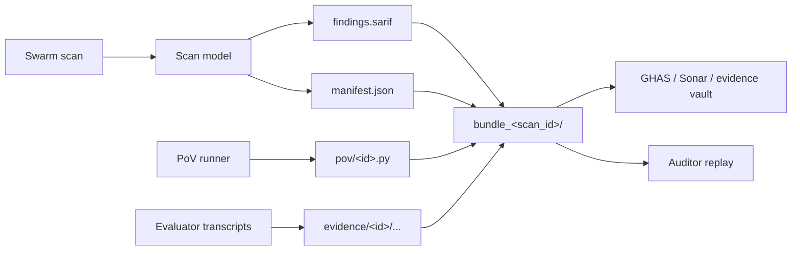

A finding bundle is a single directory that ships everything needed to reproduce, audit, and trust a scan's findings — SARIF for tool consumers, PoV scripts that re-trigger the attack, raw transcripts, and a `manifest.json` of SHA-256 checksums.

## When to use this

- You need an auditable artifact to attach to a CI run, a customer report, or a SOC 2 evidence drawer.
- A downstream consumer (GHAS, Sonar, your own evidence vault) needs SARIF plus the reproducer that proved each result.
- A finding needs to survive moving between machines — bundles are content-addressed, so tamper of any file invalidates the manifest.

## Generate a bundle

Pass `--bundle` to any `scan` invocation. The directory is created on demand.

```bash
agent-guardian scan prompt /tmp/system.txt \
  --mode full \
  --bundle ./out/bundles
```

The bundle directory is named `bundle_<scan_id>` under the path you pass. You can combine `--bundle` with `--pov-gate` to keep only findings whose reproducers re-trigger, and with `--critic` to add the LLM rubric scorer.

## Bundle layout

```text
bundle_<scan_id>/
├── findings.sarif            # SARIF 2.1.0, schema-validated
├── pov/<finding_id>.py       # PoV reproducer scripts (when captured)
├── evidence/<finding_id>/... # transcripts, raw responses
└── manifest.json             # sha256 of every file + scan envelope
```

`findings.sarif` and `manifest.json` are always written. `pov/` and `evidence/` appear only for findings that captured a reproducer or evidence file — an empty bundle is still a valid bundle.

## What a manifest looks like

The manifest is canonical (sorted-key) JSON so the bytes are reproducible:

```json
{
  "files": {
    "evidence/f-001/transcript.jsonl": {
      "bytes": 42,
      "sha256": "4a35cbf9752a837e978b129b4b266b82025dd00cc8f1d04b3ec016d5af6208ef"
    },
    "findings.sarif": {
      "bytes": 2087,
      "sha256": "0fef2b54910ff42fd1cad80fe87be7efd20d2d7866ffedecfa8dec0b1fd5561b"
    },
    "pov/f-001.py": {
      "bytes": 95,
      "sha256": "5b4cdd66691c18879ddcfb2a6ba3930caa979f3433556ad12de3d42a1360f662"
    }
  },
  "scan": {
    "aivss": 62,
    "band": "WARNING",
    "created_at": "2026-05-30T14:07:12+00:00",
    "findings_total": 1,
    "id": "cli-3a4c1d9c2840",
    "mode": "full",
    "package_version": "1.1.0",
    "tier": "T2"
  }
}
```

The `scan` envelope is the smallest set of fields a verifier needs to know which run produced the bundle — full provenance (engine, sub-scores, signatures) lives in the signed JSON report described in [Report schema reference](/reference/report-schema).

## How redaction works

PoV reproducers and evidence transcripts are the most likely files in the bundle to contain attacker-reflected secrets (the swarm's whole job is to make the target leak things). The bundle writer routes every file written under `pov/` and `evidence/` through the same `PiiRedactor` the SARIF and JSON emitters use, so a credential captured by the attacker is scrubbed before it lands on disk.

Redaction is on by default. The SARIF emitter inside the bundle inherits the same setting, so a single bundle never mixes scrubbed and unscrubbed output.

## How to verify a bundle

Recompute the checksums and compare against the manifest. Any mismatch means a file was modified, replaced, or truncated after the bundle was written.

```bash
cd bundle_cli-3a4c1d9c2840
python -c "
import hashlib, json, pathlib
m = json.loads(pathlib.Path('manifest.json').read_text())
for rel, meta in m['files'].items():
    digest = hashlib.sha256(pathlib.Path(rel).read_bytes()).hexdigest()
    status = 'OK' if digest == meta['sha256'] else 'TAMPERED'
    print(f'{status}  {rel}')
"
```

Expected output for an untampered bundle:

```text
OK  evidence/f-001/transcript.jsonl
OK  findings.sarif
OK  pov/f-001.py
```

For provenance (who produced the scan), pair the bundle with the signed JSON report and verify it — see [Signatures](/reports/signatures).

## How bundles fit the rest of the system



## Next step

- Wire the bundle's `findings.sarif` into GitHub code-scanning — see [GitHub Actions](/ci-cd/github-actions).
- Understand the SARIF and JSON shapes field-by-field in the [Report schema reference](/reference/report-schema).
