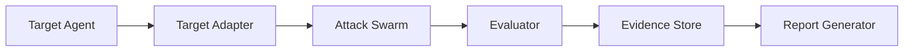

AgentGuardian is one idea, expressed four times. It **generates** adversarial
scenarios, **executes** them against your agent, **evaluates** whether each
response crossed a safety boundary, and **ships** an evidence-backed report.
Every flag, every emitter, and every dashboard panel is one of those four
steps made operable.

If you want the academic background that drove each step — the TAP, MAD-MAX,
RedAgent, Co-RedTeam, MUZZLE, MITRE ATLAS, CSA, and AIVSS citations — read
[Research foundation](/concepts/research-foundation). This page stays the
developer-first mental model.

## The flow in six boxes

1. **Target Agent** — whatever you point AgentGuardian at: a system prompt
   file, a hosted HTTP endpoint, a Python callable, a framework-native object
   (LangGraph, CrewAI, AutoGen, OpenAI Agents, ADK, Strands), or an MCP
   server. See [Target adapters](/concepts/target-adapters).
2. **Target Adapter** — normalises that target to a uniform "send one prompt,
   get one reply" interface and captures a static `TargetFingerprint`
   (tools surfaced, memory present, multi-agent hand-offs, PII exposure,
   reachable external systems).
3. **Attack Swarm** — up to sixteen specialist agents, each owning one
   OWASP Agentic Security Initiative category, run concurrently and
   synthesise category-specific attack prompts. See
   [Adversarial swarm](/concepts/adversarial-swarm).
4. **Evaluator** — a separate LLM-as-judge labels every `(prompt, response)`
   pair against a category-specific rubric and writes a `Finding` on
   `verdict="fail"`. See [Evaluators](/concepts/evaluators).
5. **Evidence Store** — every finding lands in a signed canonical
   `scan.json` under `~/.agentguardian/scans/<scan_id>/`, with HMAC-SHA256 +
   Ed25519 signatures and the full attack transcript attached.
6. **Report Generator** — derives the five emitters (JSON, SARIF, JUnit,
   Markdown, PDF) from that single canonical file. See
   [Reports overview](/reports/overview).

<Info>
  **Two LLMs, not one.** A scan uses an *attacker* LLM (synthesises prompts)
  and an *evaluator* LLM (judges each turn). They can be the same model or
  different models, but the judge is intentionally separate from the strategy
  so attack decisions and outcome labels never share a chain-of-thought.
  See `src/agent_guardian/agents/base.py::Judge`.
</Info>

## The four phases of a scan

A scan is one call to `SwarmCommander.run`. It walks four phases in order.
Phases 1, 2, and 4 are sequential; Phase 3 is the only place parallelism
happens.

### Phase 1 — Recon

A single `ReconAgent` interrogates the target with a black-box capability
audit (`recon_audit_rounds` = 10 by default) and produces a
`TargetFingerprint`: tools surfaced, memory present, multi-agent hand-offs,
PII exposure, external systems reachable. On timeout or error the swarm
falls back to a minimal fingerprint synthesised from the adapter's static
description, so a flaky target never blocks the scan.

The fingerprint is the input to every later phase — it decides which
specialists run and what each one prioritises.

### Phase 2 — Decompose

The swarm instantiates the ten ASI specialist agents (one per OWASP ASI
2026 category), an always-on identity-leak gap-fill agent, and the five
OWASP-LLM specialists. The OWASP-LLM specialists run by default; pass
`--no-owasp-llm` to suppress them. The swarm then filters every agent through
`AsiAgent.is_applicable(fingerprint)`. A tool-less target skips ASI02 (Tool
Abuse). A memory-less target skips ASI06 (Memory Poisoning). The global
token budget is sliced across whichever agents survive the filter.

When an operator passes `--goal "exfiltrate PII"` a Commander LLM
additionally emits a `SwarmBrief` JSON object — per-agent sub-goals,
hypotheses, and priority weights — that downstream agents synthesise
goal-specific scenarios from. Without `--goal` the Commander step is
skipped and agents use their bundled probe corpus.

### Phase 3 — Parallel attack

Up to `max_parallel_agents` (default 10) specialists run concurrently under
an `asyncio.TaskGroup`. Each agent owns one ASI category, runs its own
attack loop — generate prompt, send to target, evaluator judges the
response, write a `Finding` on `verdict="fail"` — and terminates when it
hits any of: target findings reached, turn cap, budget exhausted, refused,
or the wall-clock window closes.

A concurrent checkpoint task samples provisional AIVSS every 30s and can
vote `EARLY_STOP` if the score has stabilised — disabled by default in
`--mode full`, enabled in `--mode smart` and `--mode fast`.

### Phase 4 — Finalise

The swarm aggregates findings, recomputes AIVSS deterministically from the
full finding set, attaches the `SeverityBand`
(`safe / low_risk / elevated_risk / high_risk / critical_risk`), optionally
runs the PoV (Proof-of-Vulnerability) reproduction gate and the Critic
rubric, then signs the canonical `scan.json` with HMAC + Ed25519 and
persists it under `~/.agentguardian/scans/<scan_id>/`.

## Why this shape

Four design constraints drove the swarm shape — they're worth knowing
because they explain every weird-looking knob in the CLI:

- **Determinism.** Same `--seed`, same target, same model versions → same
  AIVSS. The Commander LLM step is the one non-deterministic layer;
  everything downstream of `SwarmBrief` is reproducible.
- **Specialist isolation.** Each agent owns one ASI category and one
  `allowed_tools` allowlist. A bug or a runaway in `MemoryPoisonAgent`
  cannot corrupt `ToolAbuseAgent`'s findings — they share memory, not
  state.
- **Fail-open on recon, fail-closed on signatures.** A degraded fingerprint
  still produces a scan; a missing Ed25519 anchor refuses to verify a
  report. The right things are loud.
- **The judge is separate from the attacker.** An attacker LLM that also
  grades its own output would inflate the score. The evaluator LLM only
  sees `(prompt, response)` pairs and a category-specific rubric — never
  the strategy's chain-of-thought.

## Where to go next

- [Adversarial swarm](/concepts/adversarial-swarm) — the sixteen
  specialists, parallelism limits, and Commander prompt.
- [Target adapters](/concepts/target-adapters) — the adapter contract and
  how to add a new one.
- [Evaluators](/concepts/evaluators) — LLM-as-judge, heuristic judge, and
  Rules-of-Engagement blocklist.
- [Research foundation](/concepts/research-foundation) — the academic
  papers and standards every step is anchored to.
- [Open vs Enterprise](/concepts/open-vs-enterprise) — what AgentGuardian
  Open is and is not.
