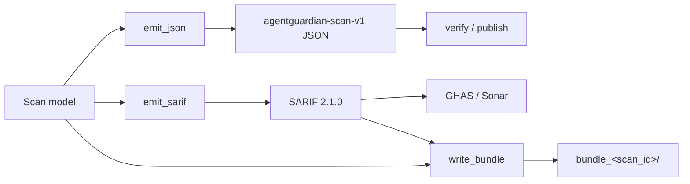

AgentGuardian emits two machine-readable report shapes: the canonical signed JSON (`agentguardian-scan-v1`) and SARIF 2.1.0 for code-scanning tool consumers. Both are deterministic (sorted-key), both are PII-redacted by default, and both surface the same underlying [Scan model](https://github.com/glacien-technologies/agent-guardian/blob/main/src/agent_guardian/models/scan.py).

## When to use this

- You are writing a parser, dashboard, or gate against a report and need to know the exact field set.
- You are debugging why a downstream consumer (GHAS, Sonar) rejected a SARIF file.
- You need to know which fields are signed and which are advisory metadata.

A static reference report generated from a real scan lives at [`docs/_assets/sample-report.pdf`](https://github.com/glacien-technologies/agent-guardian/blob/main/docs/_assets/sample-report.pdf). Open it to see the field set before you run your first scan.

## Produce a report

```bash
# JSON (default; signed, redacted)
agent-guardian scan prompt /tmp/system.txt --output json --output-path ./scan.json

# SARIF 2.1.0
agent-guardian scan prompt /tmp/system.txt --output sarif --output-path ./scan.sarif

# Other formats: junit | md | pdf
agent-guardian scan prompt /tmp/system.txt --output md --output-path ./scan.md
```

Or regenerate any format from a stored scan:

```bash
agent-guardian report cli-3a4c1d9c2840 --output sarif --output-path ./scan.sarif
```

## JSON schema: `agentguardian-scan-v1`

Top-level keys in canonical (sorted) order:

| Field | Type | Notes |
|---|---|---|
| `aivss` | `int` 0-100 | Final AIVSS score. |
| `aivss_formula_version` | `str` | Version of the AIVSS formula that produced `aivss`. |
| `asi_scores` | `{str: float}` | Per-ASI-category sub-scores (`ASI01`..`ASI10`). |
| `band` | `str` | One of `EXCELLENT`, `GOOD`, `WARNING`, `POOR`, `CRITICAL`, `not_evaluated`. |
| `budget` | `object \| null` | `{cap_usd, spent_usd, pct_of_cap, soft_stop_fraction, finalise_truncated}`. |
| `completeness` | `object \| null` | `{agents_planned, agents_completed, agents_cut_short, turns_used, turns_planned, pct}`. |
| `cost_usd` | `float` | Actual spend across all LLM roles. |
| `coverage` | `object` | Counters reconstructed from on-disk `memory.jsonl`. |
| `coverage_grade` | `str` | `A`..`F`. `A` = every ASI category covered by real evidence. |
| `created_at` | `str` (ISO 8601) | UTC if no tzinfo, else local-with-offset. |
| `duration_seconds` | `float` | Wall-clock runtime. |
| `engine` | `{commander, attacker, evaluator}` | Model IDs (e.g. `openai:gpt-4o`, `stub`). |
| `evaluation_mode` | `str` | `real \| stub \| mixed`. A `stub` evaluator yields a non-authoritative score. |
| `findings` | `[Finding]` | See below. |
| `findings_summary` | `{critical, high, medium, low}` | Counts per severity. |
| `mode` | `str` | `fast \| smart \| full`. |
| `mode_authoritative` | `bool` | `False` for non-FULL modes — `--fail-under` must refuse to gate-pass. |
| `package_version` | `str` | The `agent-guardian` version that produced the scan. |
| `probe_library_version` | `str` | Probe corpus version. |
| `scan_id` | `str` | Stable scan identifier. |
| `schema` | `str` | Always `agentguardian-scan-v1`. |
| `scoring_valid` | `bool` | `False` if the AIVSS number is not authoritative. |
| `signatures` | `object` | `{hmac_sha256, ed25519}`. Only present when `sign=True` (the CLI default). |
| `stopped_reason` | `str` | `completed \| budget \| early_stop \| cancelled`. |
| `sub_scores` | `{str: float}` | Raw component scores used to derive `aivss`. |
| `target` | `{mode, ref, inferred_goal, profile_source}` | What was scanned. |
| `tier` | `str` | `T1`..`T4`. |
| `tokens_total` | `int` | Combined input + output tokens. |
| `undertested` | `[str]` | ASI categories exercised too thinly to claim safety. |
| `audit` | `object` | Optional — present when a Stage 1B contract authorised the scan. |

### Finding object

Every entry in `findings[]` carries the full attack record:

| Field | Type | Notes |
|---|---|---|
| `id` | `str` | Stable finding ID. |
| `probe_id` | `str` | The probe that triggered. |
| `asi` | `str` | One of `ASI01`..`ASI10`. |
| `mitre_atlas` | `[str]` | ATLAS technique IDs (`AML.TNNNN[.NNN]`) or named v5.4.0 techniques. |
| `csa_category` | `str` | One of the twelve CSA Agentic-RT categories (kebab-case). |
| `severity` | `str` | `critical \| high \| medium \| low`. |
| `attempt_count` | `int` | How many turns the attacker spent on this scenario. |
| `success` | `bool` | Whether the attack succeeded. |
| `confidence` | `float` 0-1 | Evaluator confidence in the verdict. |
| `summary` | `str` | One-line description (redacted). |
| `transcript_ref` | `str \| null` | Path under `~/.agentguardian/scans/<id>/`. |
| `trigger_prompt` | `str \| null` | The attack prompt (redacted). Drives PoV replay. |
| `pov_reference` | `str \| null` | Relative path to the PoV reproducer (e.g. `pov/<id>.py`). |
| `pov_reliability` | `float \| null` | Wilson-lower-bound N-fold rerun success rate. |
| `created_at` | `str` (ISO 8601) | When the finding was recorded. |

### Sample JSON (header)

```json
{
  "aivss": 62,
  "aivss_formula_version": "1.0.0",
  "asi_scores": { "ASI01": 40.0, "ASI02": 80.0 },
  "band": "WARNING",
  "budget": {
    "cap_usd": 0.2,
    "finalise_truncated": false,
    "pct_of_cap": 30.6,
    "soft_stop_fraction": 0.8,
    "spent_usd": 0.0612
  },
  "completeness": {
    "agents_completed": 14,
    "agents_cut_short": 0,
    "agents_planned": 14,
    "pct": 100.0,
    "turns_planned": 120,
    "turns_used": 120
  },
  "coverage_grade": "A",
  "engine": {
    "attacker": "openai:gpt-4o",
    "commander": "openai:gpt-4o",
    "evaluator": "openai:gpt-4o"
  },
  "mode": "full",
  "mode_authoritative": true,
  "scan_id": "cli-3a4c1d9c2840",
  "schema": "agentguardian-scan-v1",
  "scoring_valid": true
}
```

### Signing model

When `sign=True` (CLI default), `signatures.hmac_sha256` and `signatures.ed25519` are computed over the canonical JSON of the payload **with the `signatures` key removed**. This makes signing idempotent: re-signing an already-signed payload reproduces the same bytes. Verifiers reconstruct the signed input the same way.

To verify a report:

```bash
agent-guardian verify ./scan.json \
  --pubkey-file ./signer.pub \
  --secret "$AGENT_GUARDIAN_SIGNING_SECRET"
```

Expected output:

```text
schema:       OK
HMAC-SHA256:  OK
Ed25519:      OK
trust anchor: PINNED
```

A signature alone proves only that bytes were not tampered. Provenance (who signed) requires a pinned trust anchor — without one, `verify` exits non-zero and prints `UNANCHORED`. Details in [Signatures](/reports/signatures).

## SARIF 2.1.0 schema

The SARIF emitter wraps a single `run` per scan: one `rule` per observed `probe_id`, one `result` per finding. The bundled SARIF 2.1.0 schema is enforced before the file is written — a malformed payload raises `ReportError` rather than persisting a file that downstream consumers would silently reject.

### Top-level shape

```json
{
  "$schema": "https://json.schemastore.org/sarif-2.1.0.json",
  "version": "2.1.0",
  "runs": [
    {
      "tool": { "driver": { "name": "agent-guardian", "version": "...", "rules": [...] } },
      "automationDetails": { "id": "<scan_id>" },
      "results": [...],
      "properties": {
        "aivss": 62,
        "band": "WARNING",
        "tier": "T2",
        "asi_scores": { "ASI01": 40.0, ... },
        "aivss_formula_version": "1.0.0",
        "probe_library_version": "2026.05"
      },
      "invocations": [
        { "executionSuccessful": true, "properties": { ... } }
      ]
    }
  ]
}
```

### Severity mapping

The AgentGuardian severity is mapped to SARIF's `level` field as follows:

| AgentGuardian severity | SARIF level |
|---|---|
| `critical` | `error` |
| `high` | `error` |
| `medium` | `warning` |
| `low` | `note` |

Anything outside this set defaults to `warning`.

### Result properties

Each `result` carries the verdict plus the metadata SARIF has no native slot for:

| `properties` key | Source |
|---|---|
| `aivss_severity` | `finding.severity.value` |
| `asi` | `finding.asi.value` |
| `mitre_atlas` | `finding.mitre_atlas` |
| `csa` | `finding.csa_category.value` |
| `confidence` | `finding.confidence` |
| `success` | `finding.success` |
| `attempt_count` | `finding.attempt_count` |
| `finding_id` | `finding.id` |
| `pov_reference` | `finding.pov_reference` (omitted when null) |
| `pov_reliability` | `finding.pov_reliability` (omitted when null) |

### Rule properties

Each rule (one per `probe_id` observed) carries ASI / CSA / MITRE metadata so downstream consumers don't lose taxonomy when SARIF is the only artifact they ingest:

```json
{
  "id": "pi.system-leak.v1",
  "name": "pi.system-leak.v1",
  "shortDescription": { "text": "AgentGuardian probe pi.system-leak.v1" },
  "fullDescription": {
    "text": "AgentGuardian probe pi.system-leak.v1 — Goal Hijack (CSA: goal-instruction-manipulation)."
  },
  "defaultConfiguration": { "level": "error" },
  "properties": {
    "asi": "ASI01",
    "csa": "goal-instruction-manipulation",
    "mitre_atlas": ["AML.T0051"]
  }
}
```

### Contract provenance (Stage 1B)

When a scan was authorised by a Rules-of-Engagement contract, four provenance keys are lifted onto `runs[0].properties`:

- `contract_sha256`
- `contract_version`
- `authorization_ref`
- `environment`

And the RoE budget envelope is surfaced under `runs[0].invocations[0].properties`:

- `budgets_granted`
- `budgets_consumed`
- `suppressed_tool_attempts`
- `started_at`

Absent / null values are omitted so the SARIF stays clean for partially-populated audits. `run.invocations` is always an array (SARIF 2.1.0 rejects a singular `invocation` key).

## How JSON, SARIF, and bundles fit together



## Schema versioning

| Surface | Version field | Current |
|---|---|---|
| JSON | `schema` | `agentguardian-scan-v1` |
| JSON | `aivss_formula_version` | bumped when scoring weights change |
| JSON | `probe_library_version` | bumped when the probe corpus changes |
| SARIF | `version` | `2.1.0` (fixed) |
| SARIF | `$schema` | `https://json.schemastore.org/sarif-2.1.0.json` |

Breaking changes to the JSON shape bump the `schema` string. Additive fields do not.

## Next step

- Wire SARIF into GitHub code-scanning in [GitHub Actions](/ci-cd/github-actions).
- Package the JSON, SARIF, PoVs, and transcripts together with [Evidence packs](/concepts/evidence-packs).
- Verify provenance end-to-end in [Signatures](/reports/signatures).
